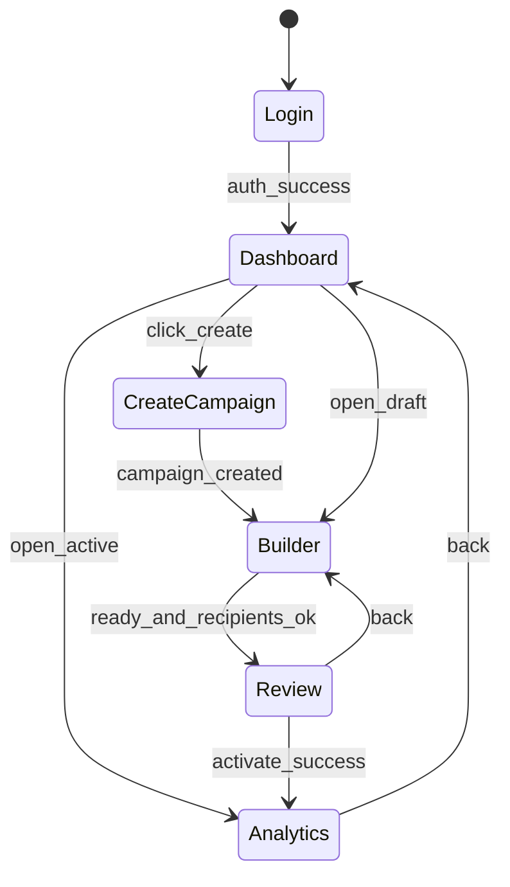

# Frontend Screen Flow

# AI-Driven Email Workflow Builder

**Version:** MVP v1  
**Purpose:** Single source of truth for React routing, navigation, and UI state before code generation.

---

## 1. High-Level Flow

```text
Login Page
    |
    v
Dashboard
    |
    +---> Create Campaign (modal or /campaigns/new)
    |
    v
AI Builder Page
    |
    +---> Chat Panel (left)
    +---> Preview Panel (right)
            +---> Workflow Preview tab
            +---> Email Preview tab
    |
    v
Review Campaign
    |
    v
Activate Workflow
    |
    v
Analytics Page
```

---

## 2. Route Map

| Route | Screen | Auth | Description |
|---|---|---|---|
| `/login` | Login | Public | Clerk sign-in |
| `/` | Dashboard | Protected | Campaign list + CTA |
| `/campaigns/new` | Create Campaign | Protected | Name campaign, start conversation |
| `/campaigns/:id/builder` | AI Builder | Protected | Chat + live previews |
| `/campaigns/:id/review` | Review Campaign | Protected | Final approval before activation |
| `/campaigns/:id/analytics` | Analytics | Protected | Metrics for active/completed campaigns |

**Redirect rules**

- Unauthenticated user on any protected route → `/login`
- Authenticated user on `/login` → `/`
- Builder without `conversation_id` → redirect to `/campaigns/new` or auto-create conversation

---

## 3. Screen Specifications

### 3.1 Login Page (`/login`)

**Components:** Clerk `<SignIn />`

**Exit:** Successful auth → `/`

**No API calls** (Clerk handles auth).

---

### 3.2 Dashboard (`/`)

**Purpose:** List user workflows and start new campaigns.

**Layout**

```text
+--------------------------------------------------+
|  Header: App name | User menu (Clerk)            |
+--------------------------------------------------+
|  [ + Create Campaign ]                           |
+--------------------------------------------------+
|  Campaign cards (grid or table)                  |
|    - name, status badge, updated_at              |
|    - actions: Open | Analytics (if active)       |
+--------------------------------------------------+
```

**API**

| Action | Method | Endpoint |
|---|---|---|
| List workflows | `GET` | `/api/workflows` *(add in implementation)* |
| Open draft/active | Navigate | `/campaigns/:id/builder` or `/analytics` |

**Status badges:** `draft` | `generating` | `awaiting_approval` | `active` | `paused` | `completed`

---

### 3.3 Create Campaign (`/campaigns/new`)

**Purpose:** Name the campaign and bind a new `conversation_id`.

**Form fields**

- Campaign name (required)
- Optional: industry hint (pre-fills AI context)

**Actions**

1. `POST /api/workflow` with `{ conversation_id }` after first chat message, **or**
2. Create conversation on first message via `POST /api/chat` with `conversation_id: null`

**Recommended MVP flow**

```text
User enters name → Navigate to /campaigns/:id/builder
First chat message creates conversation + workflow draft
```

**Exit:** Navigate → `/campaigns/:workflowId/builder`

---

### 3.4 AI Builder Page (`/campaigns/:id/builder`)

**Purpose:** Primary workspace — conversation drives workflow and email generation.

**Layout (split view)**

```text
+------------------------+---------------------------+
|  Chat Panel (40%)      |  Preview Panel (60%)      |
|                        |                           |
|  Message list          |  [Workflow] [Email] tabs  |
|  Scrollable history    |                           |
|                        |  Workflow: step diagram   |
|  Input + Send          |  Email: subject + HTML    |
|  Regenerate email btn  |  Plain text toggle        |
|                        |                           |
+------------------------+---------------------------+
|  Footer: Upload CSV | Manual recipients | Review → |
+------------------------+---------------------------+
```

**Chat Panel**

- Renders `messages[]` from API responses
- Streaming optional in MVP (polling or single response is fine)
- Disabled input while `status === "generating"`

**Preview Panel — Workflow tab**

- Renders `workflow_preview` from `POST /api/chat`
- Updates after each AI turn when `workflow_definition` changes

**Preview Panel — Email tab**

- Renders `email_preview` (subject, HTML, plain text)
- **Regenerate** opens inline instruction → `POST /api/chat` or dedicated regenerate endpoint per LLD

**Recipient section (collapsible drawer or modal)**

| Action | Method | Endpoint |
|---|---|---|
| Upload CSV | `POST` | `/api/recipients/upload` (multipart) |
| Show validation summary | Response | `{ total, valid, invalid, invalid_rows }` |

**Footer actions**

| Button | Condition | Navigate / API |
|---|---|---|
| Continue to Review | `status === "ready"` AND recipients valid | `/campaigns/:id/review` |
| Save draft | Always | Implicit via chat persistence |

**API per message**

```text
POST /api/chat
Body: { conversation_id, message }
Response: { reply, workflow_preview, email_preview, status }
```

**LangGraph stage indicator (optional MVP UI)**

Show `current_stage` from conversation state as a progress stepper (see `LangGraph_State_Diagram.md`).

---

### 3.5 Review Campaign (`/campaigns/:id/review`)

**Purpose:** Read-only summary before activation — no new AI discovery here.

**Sections**

1. Campaign summary (goal, audience, tone, CTA)
2. Workflow diagram (final `workflow_definition`)
3. Email previews per step
4. Recipient count + validation status
5. Approve checkbox + legal/confirmation copy

**Actions**

| Button | API | Result |
|---|---|---|
| Back to Builder | Navigate | `/campaigns/:id/builder` |
| Activate Workflow | `POST /api/workflow/activate` | Status `active`, queue runs |
| Pause (post-activation link) | `POST /api/workflow/pause` | Only from analytics or dashboard |

**Guard:** Block activation if `valid recipients === 0` or `status !== "ready"`.

**Exit:** Success → `/campaigns/:id/analytics` with toast "Workflow activated"

---

### 3.6 Analytics Page (`/campaigns/:id/analytics`)

**Purpose:** Campaign performance after activation.

**Layout**

```text
+--------------------------------------------------+
|  Campaign name | Status: active | [ Pause ]      |
+--------------------------------------------------+
|  KPI cards: sent | delivered | opened | clicked  |
|              replied | failed | bounced           |
+--------------------------------------------------+
|  Rates: open_rate | reply_rate                   |
+--------------------------------------------------+
|  Link: Back to Dashboard | Edit (if draft only)  |
+--------------------------------------------------+
```

**API**

```text
GET /api/analytics/{workflow_id}
```

**Polling:** Refresh every 30s while `status === "active"` (MVP).

---

## 4. Navigation State Machine



---

## 5. Client-Side State (per session)

| Store key | Scope | Source |
|---|---|---|
| `conversation_id` | Builder | API chat responses |
| `workflow_id` | Campaign | URL param `:id` |
| `chat_messages` | Builder | Append each chat response |
| `workflow_preview` | Builder | Latest from API |
| `email_preview` | Builder | Latest from API |
| `recipient_summary` | Builder / Review | Upload API response |

**Server state:** TanStack Query (`useQuery` / `useMutation`) — see `frontend/src/api/hooks/`.

**Client-only UI state:** React `useState` / `useReducer` in page components (chat input draft, active preview tab). Do not duplicate API data in Zustand.

| Query key | Hook | Screen |
|---|---|---|
| `['workflows']` | `useWorkflows()` | Dashboard |
| `['workflow', id]` | `useWorkflow(id)` | Builder, Review |
| `['analytics', id]` | `useAnalytics(id)` | Analytics |
| — | `useChat()` mutation | Builder |
| — | `useUploadRecipients()` mutation | Builder |
| — | `useActivateWorkflow()` mutation | Review |

Invalidate `['workflow', id]` and `['analytics', id]` after successful activation.

---

## 6. Component Tree (implementation hint)

```text
App
├── ThemeProvider (MUI)
├── QueryClientProvider (TanStack Query)
├── AuthProvider (Clerk)
├── AppShell (MUI AppBar + navigation)
├── Router
│   ├── LoginPage
│   ├── DashboardPage
│   │   └── CampaignCard[]
│   ├── CreateCampaignPage
│   ├── BuilderPage
│   │   ├── ChatPanel
│   │   │   ├── MessageList
│   │   │   └── ChatInput
│   │   ├── PreviewPanel
│   │   │   ├── WorkflowPreview
│   │   │   └── EmailPreview
│   │   └── RecipientUploadModal
│   ├── ReviewPage
│   │   ├── WorkflowSummary
│   │   ├── EmailSummaryList
│   │   └── ActivateButton
│   └── AnalyticsPage
│       └── MetricsGrid
```

---

## 7. Error & Empty States

| Screen | State | UX |
|---|---|---|
| Dashboard | No campaigns | Empty state + "Create your first campaign" |
| Builder | AI error | Toast + retry last message |
| Builder | Invalid CSV | Inline table of `invalid_rows` |
| Review | Missing recipients | Disable Activate + link to Builder upload |
| Analytics | No events yet | Zero metrics + "Data updates as emails send" |

---

## 8. Out of Scope for MVP UI

Do **not** build screens for:

- Custom domains configuration
- A/B test variant picker
- Multi-tenant org switcher
- CRM connection wizard
- Per-recipient email editor
- SMS / WhatsApp channels

See `MVP_Scope.md`.

---

## 9. Implementation Order

```text
1. Vite + MUI theme + TanStack Query provider
2. api/client.ts + queryKeys + Clerk token
3. Clerk auth + protected routes (MUI AppShell)
4. Dashboard — useWorkflows() query
5. Builder — useChat() mutation + MUI split layout
6. Preview panels (MUI Tabs: Workflow | Email)
7. CSV upload — useUploadRecipients() + MUI Dialog
8. Review + useActivateWorkflow() mutation
9. Analytics — useAnalytics() with refetchInterval
```

## 10. MUI component mapping

| UI element | MUI component |
|---|---|
| App layout | `AppBar`, `Drawer`, `Container`, `Box` |
| Campaign list | `Card` / `DataGrid` or `Table` |
| Chat | `Paper`, `List`, `ListItem`, `TextField`, `IconButton` |
| Preview tabs | `Tabs`, `Tab`, `TabPanel` |
| Upload | `Dialog`, `Button`, `Alert` for errors |
| Review | `Checkbox`, `Button` variant contained |
| Analytics KPIs | `Grid`, `Card`, `Typography` |
| Loading / errors | `CircularProgress`, `Alert`, `Snackbar` |
