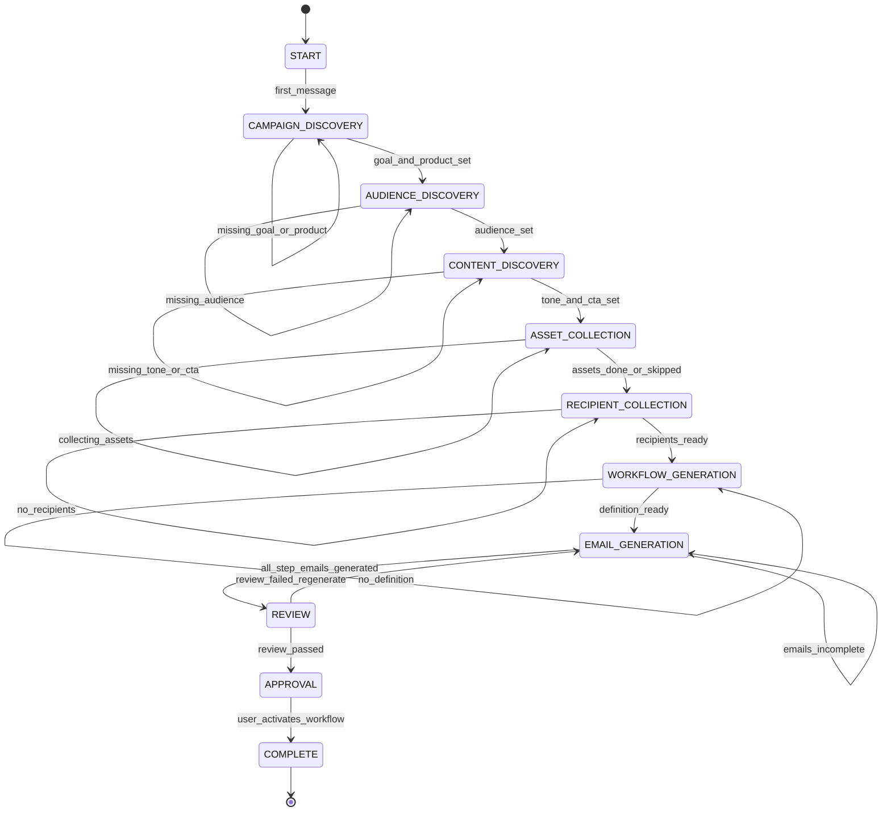

# LangGraph State Diagram

# AI-Driven Email Workflow Builder

**Version:** MVP v1  
**Purpose:** Explicit graph stages for Cursor code generation — maps 1:1 to `CampaignState.current_stage` and supervisor routing.

---

## 1. Stage Pipeline (Authoritative)

```text
START
  |
  v
CAMPAIGN_DISCOVERY
  |
  v
AUDIENCE_DISCOVERY
  |
  v
CONTENT_DISCOVERY
  |
  v
ASSET_COLLECTION
  |
  v
RECIPIENT_COLLECTION        <-- UI/upload; graph may pause until recipients exist
  |
  v
WORKFLOW_GENERATION
  |
  v
EMAIL_GENERATION
  |
  v
REVIEW
  |
  v
APPROVAL                    <-- Human gate; not an LLM node in MVP
  |
  v
COMPLETE
```

---

## 2. Stage Definitions

| Stage | Agent node | Required state fields | Exit condition |
|---|---|---|---|
| `START` | `supervisor` | `conversation_id`, `user_id` | First user message received |
| `CAMPAIGN_DISCOVERY` | `campaign_agent` | — | `business_goal` AND `product_info` set |
| `AUDIENCE_DISCOVERY` | `audience_agent` | campaign fields | `audience` set |
| `CONTENT_DISCOVERY` | `content_agent` | audience set | `tone` AND `cta` set |
| `ASSET_COLLECTION` | `content_agent` *(or dedicated asset node)* | content set | `attachments` collected OR user skips |
| `RECIPIENT_COLLECTION` | `validation_agent` *(external)* | — | `recipient_count > 0` on workflow |
| `WORKFLOW_GENERATION` | `workflow_agent` | content complete | `workflow_definition` non-empty |
| `EMAIL_GENERATION` | `copywriter_agent` | workflow exists | `generated_emails` covers all `send_email` steps |
| `REVIEW` | `review_agent` | emails exist | `review_passed == true` |
| `APPROVAL` | — *(no graph node)* | review passed | User clicks Activate on Review screen |
| `COMPLETE` | `END` | workflow activated | Terminal |

---

## 3. State Diagram (Mermaid)



---

## 4. Supervisor Routing (implementation)

```python
# app/langgraph/nodes.py — route_to_next_agent()

STAGE_ORDER = [
    "CAMPAIGN_DISCOVERY",
    "AUDIENCE_DISCOVERY",
    "CONTENT_DISCOVERY",
    "ASSET_COLLECTION",
    "RECIPIENT_COLLECTION",
    "WORKFLOW_GENERATION",
    "EMAIL_GENERATION",
    "REVIEW",
]

def resolve_stage(state: CampaignState) -> str:
    if not state.get("business_goal") or not state.get("product_info"):
        return "CAMPAIGN_DISCOVERY"
    if not state.get("audience"):
        return "AUDIENCE_DISCOVERY"
    if not state.get("tone") or not state.get("cta"):
        return "CONTENT_DISCOVERY"
    if state.get("requires_assets") and not state.get("assets_complete"):
        return "ASSET_COLLECTION"
    if not state.get("recipients_ready"):
        return "RECIPIENT_COLLECTION"
    if not state.get("workflow_definition"):
        return "WORKFLOW_GENERATION"
    if not emails_complete(state):
        return "EMAIL_GENERATION"
    if not state.get("review_passed"):
        return "REVIEW"
    return "COMPLETE"


def route_to_next_agent(state: CampaignState) -> str:
    stage = resolve_stage(state)
    state["current_stage"] = stage

    if stage == "COMPLETE":
        return "end"
    if stage == "RECIPIENT_COLLECTION":
        # Pause graph — frontend handles CSV; resume on next chat after upload
        return "end"
    if stage == "CAMPAIGN_DISCOVERY":
        return "campaign_agent"
    if stage == "AUDIENCE_DISCOVERY":
        return "audience_agent"
    if stage in ("CONTENT_DISCOVERY", "ASSET_COLLECTION"):
        return "content_agent"
    if stage == "WORKFLOW_GENERATION":
        return "workflow_agent"
    if stage == "EMAIL_GENERATION":
        return "copywriter_agent"
    if stage == "REVIEW":
        return "review_agent"
    return "end"
```

---

## 5. Graph Topology (nodes + edges)

```text
                    +-------------+
                    |  supervisor |<------------------+
                    +------+------+                   |
                           |                          |
              conditional_edges(route_to_next_agent)  |
                           |                          |
     +----------+----------+----------+----------+-----+-----+
     |          |          |          |          |           |
     v          v          v          v          v           v
 campaign   audience   content   workflow  copywriter    review
  agent      agent      agent      agent      agent       agent
     |          |          |          |          |           |
     +----------+----------+----------+----------+-----------+
                           |
                           +---------> (all return to supervisor)

copywriter_agent --> review_agent --> supervisor
```

**Entry point:** `supervisor`  
**Terminal:** `END` when `current_stage == "COMPLETE"` or waiting on `RECIPIENT_COLLECTION` / `APPROVAL`

---

## 6. `CampaignState` fields per stage

```python
# app/langgraph/state.py — extend CampaignState

class CampaignState(TypedDict):
    # ... existing fields from LLD ...

    current_stage: str                    # One of stages in Section 1
    requires_assets: bool                 # Set by content_agent if user mentions files
    assets_complete: bool                 # True after upload or explicit skip
    recipients_ready: bool                # Set true when recipient_service confirms count > 0
    review_passed: bool
    approval_status: str                  # "pending" | "approved" — set on activate API only
```

**Persistence:** Mirror `current_stage` and key flags in `conversations.campaign_state` (see LLD).

---

## 7. Human vs AI boundaries

| Stage | Driven by |
|---|---|
| `CAMPAIGN_DISCOVERY` → `REVIEW` | LangGraph + user chat |
| `RECIPIENT_COLLECTION` | User CSV/manual upload; graph sets `recipients_ready` via API callback |
| `APPROVAL` | Review page — `POST /api/workflow/activate` |
| `COMPLETE` | WorkflowService + Celery — **outside** LangGraph |

> **Cursor rule:** Do not run Celery or send email inside LangGraph nodes. Execution is strictly post-`APPROVAL`.

---

## 8. Chat API status mapping

| `current_stage` | API `status` in ChatResponse |
|---|---|
| `START` … `REVIEW` (in progress) | `"collecting"` or `"generating"` |
| `REVIEW` passed, awaiting approval | `"ready"` |
| `APPROVAL` / `COMPLETE` | `"ready"` / workflow status from DB |

---

## 9. Regeneration flows (stay in stage)

| User action | Stage after | Node |
|---|---|---|
| "Make tone more casual" during content | `CONTENT_DISCOVERY` | `content_agent` |
| "Add a wait step" during workflow | `WORKFLOW_GENERATION` | `workflow_agent` |
| "Rewrite subject line" | `EMAIL_GENERATION` | `copywriter_agent` → `review_agent` |
| Review fails grammar | `REVIEW` | `review_agent` → may loop to `copywriter_agent` |

Set `review_passed = false` when copywriter re-runs.

---

## 10. Alignment with LLD agents

| LLD agent file | Primary stage(s) |
|---|---|
| `campaign_agent.py` | `CAMPAIGN_DISCOVERY` |
| `audience_agent.py` | `AUDIENCE_DISCOVERY` |
| `content_agent.py` | `CONTENT_DISCOVERY`, `ASSET_COLLECTION` |
| `validation_agent.py` | `RECIPIENT_COLLECTION` (validation only) |
| `workflow_agent.py` | `WORKFLOW_GENERATION` |
| `copywriter_agent.py` | `EMAIL_GENERATION` |
| `review_agent.py` | `REVIEW` |
| `supervisor_agent.py` | All transitions |
